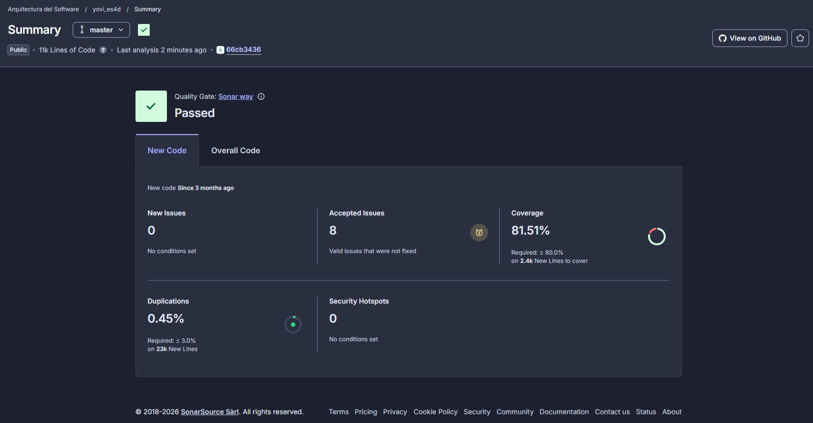

ifndef::imagesdir[:imagesdir: ../images]

[[section-testing-report]]

== Informe de Pruebas

=== Test unitarios
Cada componente tiene sus correspondientes pruebas unitarias que verfican que funciona correctamente, proporcionando seguridad, fiabilidad y consistencia al proyecto realizado. Se han realizado pruebas unitarias tanto de front como de back, utilizando las herramientas Jest y JUnit respectivamente. Estas pruebas se ejecutan automáticamente en cada commit mediante GitHub Actions, lo que garantiza que cualquier cambio en el código no rompa funcionalidades existentes.

*Cobertura de código*

Para la cobertura de código utilizamos la herramienta SonarQube. Esta herramienta ofrece una métrica que indica qué porcentaje del código fuente ha sido ejecutado por las pruebas automatizadas (unitarias, de integración, etc.). Es un indicador clave de la calidad del software y de cuán bien está siendo probado.
Para este proyecto nos piden un 80% de cobertura de código y menos de un 3% de duplicación. En la siguiente imagen vemos como cumplimos con estos dos parámetros:

=== Test E2E

Los tests end-to-end (E2E) se utilizan para verificar que toda la aplicación funciona correctamente desde la perspectiva del usuario final. Simulan escenarios reales de uso, interactuando con la interfaz tal como lo haría un usuario, para asegurar que todos los componentes del sistema (frontend, backend, base de datos, etc.) funcionan como se espera. Estos tests son cruciales para detectar problemas de integración y garantizar que la experiencia del usuario sea fluida y sin errores. Para llevar a cabo estas pruebas hemos utilizado la herramienta Cypress, que nos ha permitido automatizar escenarios de prueba complejos y validar el comportamiento de la aplicación en diferentes situaciones.

En nuestro proyecto hemos incorporado los siguientes casos de prueba E2E:

. **Cambio de contraseña: **  
  Verifica el correcto funcionamiento del formulario de cambio de contraseña, incluyendo los casos de éxito y los principales errores de validación, como contraseñas no coincidentes, contraseñas que no cumplen con los requisitos de seguridad y la gestión de errores del servidor. 

. **Simulación de un juego: **  
  Verifica que el usuario pueda configurar e iniciar una partida con distintas opciones, como el número de jugadores (humano vs humano o humano vs bot), el nivel de dificultad y el tipo de juego. Además, se comprueba que la partida se desarrolle correctamente, incluyendo la interacción con la interfaz, la actualización del estado del juego y la gestión de eventos durante la partida.

. **Inicio de sesión: **  
  Comprueba que el sistema gestione correctamente intentos de inicio de sesión con credenciales inválidas, incluyendo la visualización de mensajes de error y la limitación de intentos fallidos por motivos de seguridad.

. **Registro de usuario: **  
  Verifica que un nuevo usuario pueda completar el formulario de registro correctamente y que el sistema gestione adecuadamente errores comunes como contraseñas inválidas, contraseñas no coincidentes y nombres de usuario ya registrados.

=== Test de carga
Los tests de carga miden el rendimiento antes de la carga normal o de carga máxima. Para llevar a cabo estas pruebas hemos utilizado la herramienta Gatling. Para ello hemos probado diferentes escenarios de carga, como el inicio de sesión simultáneo de múltiples usuarios, la creación de partidas y la simulación de partidas en curso. Estas pruebas nos han permitido identificar posibles cuellos de botella en el rendimiento y optimizar la aplicación para manejar un mayor número de usuarios concurrentes sin degradar la experiencia del usuario. Tambien se ha probado con carga de usuario baja (25 usuarios) y carga de usuario alta (250 usuarios) para comprobar el rendimiento del sistema en diferentes condiciones.

Toda la información sobre las pruebas realizadas en nuestro trabajo aparece en el este enlace:

link:https://github.com/Arquisoft/yovi_es4d/wiki/Informe-de-pruebas-de-carga-(Gatling)-%E2%80%94-24-04-2026[Informe de pruebas de carga (Wiki)]